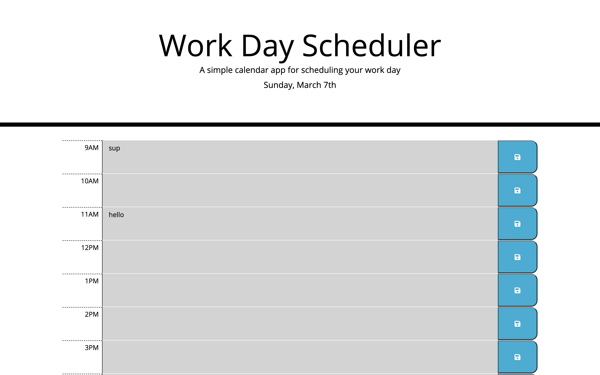

# Work Day Scheduler

## Description
This application allows you to create and save a schedule based on the tasks you need to complete in a 9-5 workday. Each hour is divided into its own textarea where you can enter whatever it is you need to do based on that hour. You can then click the save button which will load the information provided into the localStorage. This information is then loaded back onto the page whenever the task is loaded. The application also uses moment.js to keep track of what day it is, and what time it is during the day. The time slots that have not yet passed will have a green background, the past hours will be grey, and the current hour slot will be red. As you go through the day you can use this application to keep track of what you need to do.

## Built With
* JavaScript
* HTML
* CSS

## Screenshot

> This screen shot shows the home page of the work day scheduler.

## Website
https://spencermoyer22.github.io/work-day-scheduler/

## Contribution
Made by Spencer Moyer
